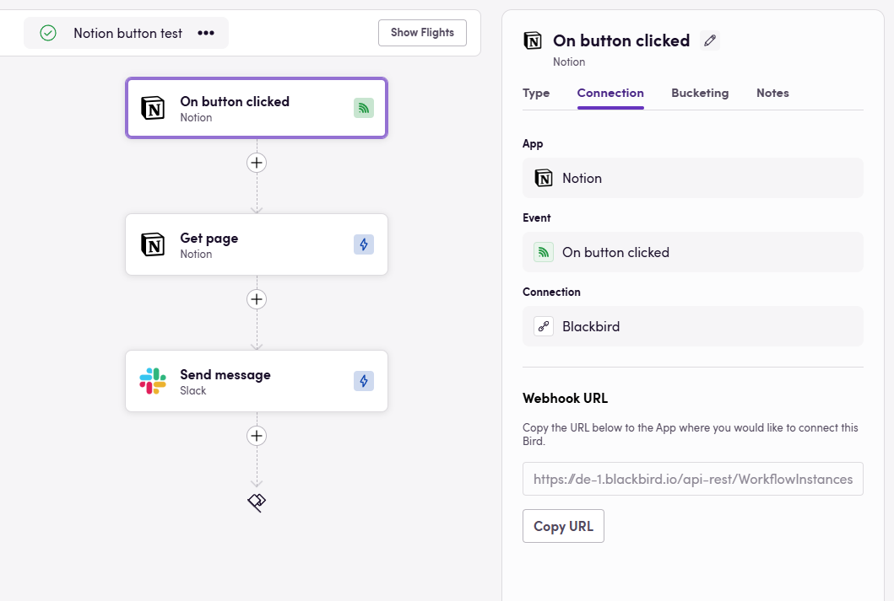
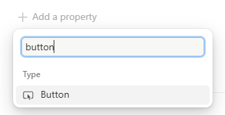

# Blackbird.io Notion  
  
Blackbird is the new automation backbone for the language technology industry. Blackbird provides enterprise-scale automation and orchestration with a simple no-code/low-code platform. Blackbird enables ambitious organizations to identify, vet and automate as many processes as possible. Not just localization workflows, but any business and IT process. This repository represents an application that is deployable on Blackbird and usable inside the workflow editor.  
  
## Introduction  
  
<!-- begin docs -->  
  
Notion is a note-taking and idea-organizing platform. This Notion application primarily centers around page and database management.  
  
 ## Before setting up
 Before you can connect you need to make sure that:
 - You have a Notion account
 - You have sufficient permissions in the workspace you want to connect Blackbird with.
 
## Connecting  
  
1. Navigate to apps and search for Notion. 
2. Click _Add Connection_.  
3. Name your connection for future reference e.g. 'My Notion connection'.  
4. Click _Authorize connection_.
5. In the popup, select the workspace you want to connect to in the top right corner.
6. Click _Select pages_
7. Manually select all the pages you want Blackbird to access.
8. Click _Allow access_
9. Confirm that the connection has appeared and the status is _Connected_.  
  
> If you later want to give Blackbird the ability to access other pages, you can do so manually through the page options in Notion.

## Actions  
  
### Blocks  
  
- **Search block's children** returns all children of a specified block. Instead of block you can input ID of a `Page`, so that it will return all blocks belonging the that page.  
- **Get/Delete block** 

### Comments

- **Search comments** returns a list of comments added to the specified `Block`.
- **Add comment** adds comment to a specified `Page` or `Discussion`.

### Databases

- **Search databases** returns a list of all databases in the workspace. You can filter the list by create/edited time.
- **Search pages in database** returns a list of all child `Pages` in the database. You can filter the list by create/edited time. 
- **Create/Get database**

### Pages

- **Search pages** returns a list of all pages in the workspace. You can filter the list by create/edited time.
- **Get page as HTML** returns specified page's content as an HTML file.
- **Create/Update page from HTML** creates/updates a page from an HTML file. We recommend using the 'Create page from HTML' action, as it doesn't affect existing content. On the other hand, the 'Update page from HTML' action does affect existing content. Since Notion doesn't allow updating blocks directly, it will first delete all the content of the page and then add it from the HTML file.
- **Get page string/number/date/boolean/files/multiple property** returns the value of a database entry's property of specific type.
- **Set page string/number/boolean/files/multiple property** updates the value of a database entry's property of specific type.
- **Get pages related via property** returns a list of pages related to the specified page via a relation property. Note, that Blackbird must have access to the database where the relation property is defined, otherwise Notion API returns empty results.
- **Set page relation property** updates the relation property of a page, allowing you to link it to other pages in the specified database.
- **Set page property as empty**
- **Create/Get/Archive page**

> For the 'Create page' and 'Create page from HTML' actions, you must specify the parent page or database where the new page will be created. If not specified, the action will fail with an error.

### Users

- **Search users** returns a list of users belonging to the workspace.
- **Get users** returns details about specified user.

## Events

### Pages

- **On pages created** Monitors pages whose has created within a specified time range. To allow Blackbird access to the newly created pages you should do so manually through the page options in Notion
- **On pages updated** Monitors pages whose has updated within a specified time range.
- **On pages status changed** Monitors a database for pages whose status has changed to the desired value within a specified time range.
- **On button clicked** triggers when a user clicks on a button in Notion. See setup instructions below.

## Triggering on button clicked

1. Create a Bird that starts with the event *On button clicked*
2. Configure the Bird and publish it.

3. Copy the Webhook URL at the bottom of the event panel.
4. Create a button in Notion. You can do this either inside page content or as a page property.

5. Click on *Edit automation*. Then click on *+ New action* and select *Send webhook*

6. Paste the URL you copied from Blackbird in the URL field and click *Done*.

7. Test the button by clicking on the button!

## HTML Conversion

Blackbird can convert `Page` content to an HTML file and back, enabling automatic translation of Notion content via Blackbird. For example, you can set up a workflow like this: "Notion: Get page as HTML" → "DeepL: Translate" → "Notion: Update page from HTML."

Untranslatable content will also be transferred, with a few exceptions. These include:

- **Link preview**
- **Notion-hosted files** (such as PDFs, audio, video, or images; however, external URLs will work fine)

For now, these types won't be transferred. We are continuously working to improve this process.

> Translating child pages and child databases is fully supported. You can translate child pages and/or child databases by setting the 'Include child pages' and 'Include child databases' optional inputs to true for the 'Get page as HTML' action. If these inputs are not set or are set to false, we will not extract or translate child pages/databases, and the new (or updated) page will not include these child pages/databases.

> Please note that the Notion API only allows creating pages or databases when their parent is a **page or a database**. This means that if you nest a subpage or database inside a column (or any other block), the operation will fail with an error similar to:  
> `Pages and databases cannot be nested inside other blocks. Page or database ('Page name or ID') has parent type 'block_id'. Please move it to the root level.`  
> To resolve this issue, ensure that all subpages and sub-databases are placed at the root level and are not nested within other blocks.

## Demo video

Streamline your Notion workflows with Blackbird.io

import { YouTube } from '@astro-community/astro-embed-youtube';

<YouTube id="https://youtu.be/WP7L8AefTMA" />

### Limitations

While improving the Notion app, fixing issues, and enhancing error messages, we identified several API limitations that impact functionality:

1. **Databases with `status` properties cannot be created via the Notion API** ([Reference](https://developers.notion.com/reference/create-a-database)). Additionally, the API does not allow storing status properties in a page. As a result, after recreation, columns of type 'status' will be lost.

2. **Only the table view of a database is accessible via the API.** The API does not differentiate between a board view element and a database, and it does not provide any information about different views within a database. As a result, views cannot be recreated, and only the table view is available.

3. **Pages and databases can only be created under an existing page or database.** The API does not allow placing a subpage or database inside a column or any other block. Subpages and databases must be created directly under a page or database and cannot be nested inside other content blocks ([Reference](https://developers.notion.com/reference/post-page)).

4. **Impossible to re-add Notion hosted files**

5. **Nesting depth limited to 2 levels.** The Notion API restricts block nesting to a maximum depth of 2 levels. If the original page has blocks with more than 2 nested children, the 'Create/Update page from HTML' action will fail with a validation error. See the [API reference](https://developers.notion.com/reference/patch-block-children) for more details.

6. **UI vs API feature parity issues.** Blocks created via the API may render differently than those created through the UI. For example, bookmarks might lose cover images and descriptions, and code blocks might lose syntax highlighting. This occurs because the Notion API doesn't support all features available in the UI.

## Feedback  
  
Do you want to use this app or do you have feedback on our implementation? Reach out to us using the [established channels](https://www.blackbird.io/) or create an issue.
  
<!-- end docs -->